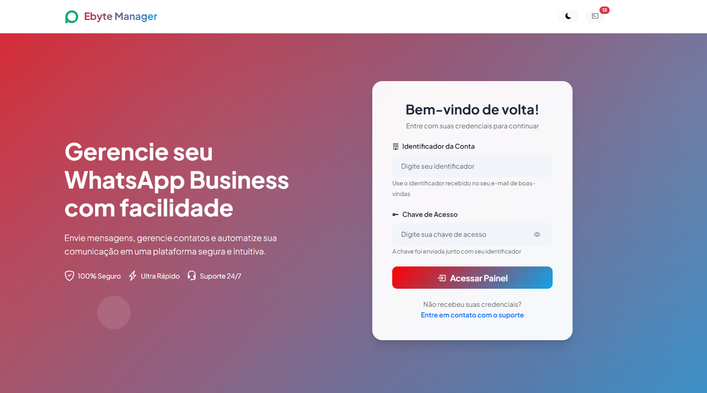
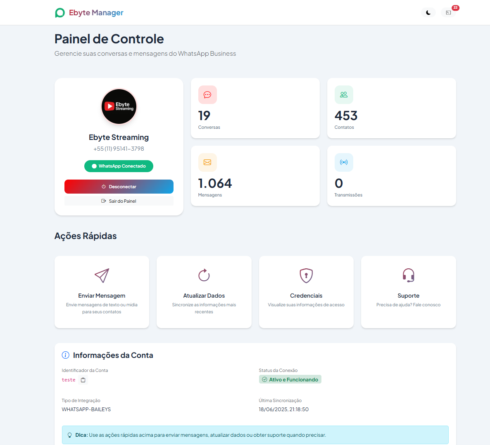
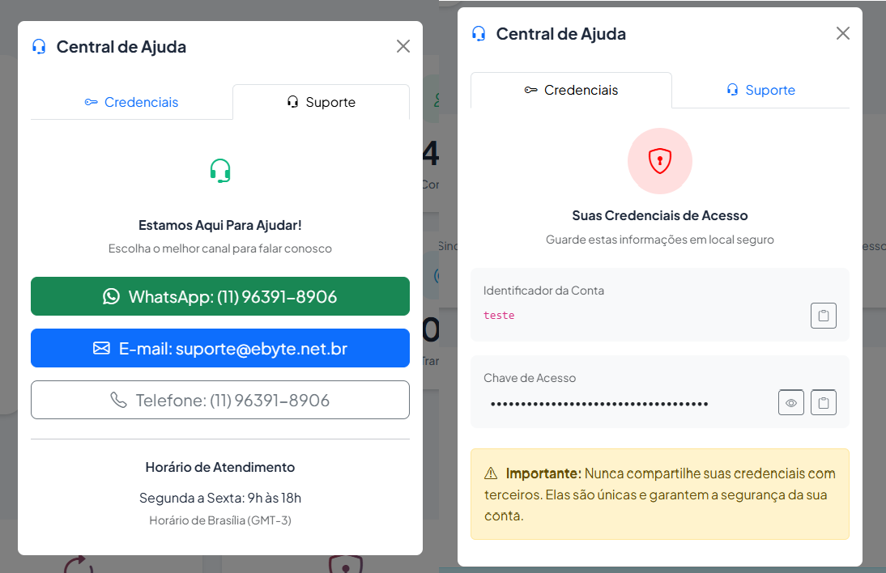

# Ebyte Manager V4 - WhatsApp Business SaaS

<p align="center">
  
  
  
  
  
</p>

<p align="center">
  
  
  
  
</p>

## 🚀 Sobre o Ebyte Manager V4

O **Ebyte Manager V4** é uma solução **SaaS profissional** que permite aos provedores oferecer WhatsApp Business as a Service (WBaaS) de forma segura e escalável. Desenvolvido para resolver a limitação do Manager oficial da Evolution API que requer acesso administrativo global, nosso sistema permite que cada cliente acesse apenas sua própria instância usando autenticação por token.

### 🎯 Por que o Ebyte Manager foi criado?

O Manager oficial da Evolution API requer a API Key global (administrativa) para acesso, o que:
- ❌ Expõe todas as instâncias para qualquer usuário
- ❌ Impossibilita a revenda como SaaS/Whitelabel
- ❌ Cria riscos de segurança graves
- ❌ Não permite isolamento entre clientes

**Nossa solução:**
- ✅ Cada cliente acessa apenas sua instância
- ✅ Autenticação segura por token individual
- ✅ Isolamento total entre clientes
- ✅ Pronto para Whitelabel e revenda
- ✅ Interface 100% comercial (sem termos técnicos)

## ✨ Principais Características

### 🔐 Segurança Enterprise
- **Autenticação dupla obrigatória** (Identificador + Token único)
- **Validação server-side** em todas as operações
- **Sessão criptografada** com expiração automática
- **Rate limiting** para proteção contra ataques
- **Isolamento total** entre instâncias

### 🎨 Interface Premium SaaS
- **Design moderno** com gradientes e animações profissionais
- **100% responsivo** - Mobile-first
- **Dark/Light mode** automático
- **Linguagem comercial** - Sem termos técnicos
- **Central de ajuda** integrada
- **Logs opcionais** (podem ser ocultados)

### ⚡ Performance e Compatibilidade
- **Detecção automática** da versão Evolution API
- **Suporte completo** para Evolution V2 e Lite
- **Normalização de dados** entre versões
- **Carregamento instantâneo**
- **Animações fluidas** sem travamentos

## 📸 Screenshots

### Tela de Login


- Landing page profissional com hero section
- Formulário elegante com validação em tempo real
- Elementos visuais animados e gradientes modernos
- Informações do produto em destaque

### Dashboard


- Cards de estatísticas coloridos e interativos
- Perfil do usuário com avatar e status
- Ações rápidas com ícones intuitivos
- Logs do sistema ocultáveis (badge com contador)

### Central de Ajuda


- Modal elegante com sistema de abas
- Visualização segura de credenciais
- Canais de suporte integrados
- Horário de atendimento personalizado

## 🔧 Compatibilidade

### ✅ Versões Suportadas
- **Evolution API V2** (2.2.3) - Suporte completo
- **Evolution API Lite** (2.2.1) - Suporte completo

### ❌ Versões Não Suportadas
- **Evolution API V1** (1.8.2 e anteriores) - API muito limitada

O sistema detecta automaticamente a versão da Evolution API e se adapta para funcionar perfeitamente!

## 🛠️ Instalação

### Requisitos
- PHP >= 7.4
- Servidor Web (Apache/Nginx)
- Extensão cURL habilitada
- Evolution API V2 ou Lite configurada
- SSL recomendado para produção

### Passo a Passo

1. **Clone ou extraia os arquivos**
   ```bash
   git clone https://github.com/elvisfalmeida/ebyte-manager-api.git
   cd ebyte-manager-api
   ```

2. **Configure o arquivo .env**
   ```bash
   cp .env.example .env
   nano .env
   ```

3. **Personalize suas configurações**
   ```env
   # API Evolution (V2 ou Lite)
   API_URL=https://sua-evolution-api.com
   API_KEY=sua-chave-global-admin
   
   # Identidade Visual
   PRIMARY_COLOR=#7341ff
   LOGO_LIGHT=https://sua-logo-clara.png
   LOGO_DARK=https://sua-logo-escura.png
   FAVICON=https://seu-favicon.ico
   
   # Informações de Suporte
   SUPPORT_EMAIL=suporte@suaempresa.com
   SUPPORT_WHATSAPP=(11) 99999-9999
   SUPPORT_HOURS=Segunda a Sexta: 9h às 18h
   
   # Branding
   APP_NAME=Sua Empresa WhatsApp
   APP_VERSION=4.1.0
   ```

4. **Ative sua licença**
   ```
   Acesse: https://seu-dominio.com/install.php
   ```

5. **Configure permissões**
   ```bash
   chmod 755 logs/
   chmod 644 .htaccess
   ```

6. **Remova o instalador**
   ```bash
   rm install.php
   ```

## 📱 Como Funciona

### Para o Administrador SaaS

1. **Criar instâncias via Evolution API**
   - Use a API Key global para criar instâncias
   - Cada instância recebe um token único
   - Envie credenciais aos clientes

2. **Gestão de clientes**
   - Cada cliente acessa apenas sua instância
   - Isolamento total entre clientes
   - Logs centralizados por instância

### Para o Cliente Final

1. **Acesso simplificado**
   - Recebe credenciais (Identificador + Chave)
   - Acessa o painel personalizado
   - Interface 100% comercial

2. **Recursos disponíveis**
   - Conexão do WhatsApp via QR Code
   - Envio de mensagens em massa
   - Suporte a mídia (imagens, vídeos, PDFs, áudios)
   - Intervalos inteligentes anti-spam
   - Central de ajuda integrada

## 🎨 Personalização

### Cores e Temas
O sistema permite personalização completa via `.env`:
```env
PRIMARY_COLOR=#FF5722  # Laranja vibrante
PRIMARY_COLOR=#4CAF50  # Verde moderno
PRIMARY_COLOR=#2196F3  # Azul profissional
PRIMARY_COLOR=#9C27B0  # Roxo elegante
```

### Logos e Branding
- Logos separados para tema claro/escuro
- Favicon personalizado
- Nome da empresa em toda interface
- Informações de suporte customizáveis

## 📊 Arquitetura do Sistema

```
ebyte-manager-v4/
├── 📁 assets/
│   └── 📁 js/
│       ├── 📄 app-v4.js       # Core do sistema
│       └── 📄 modal-v3.js     # Sistema de modais
├── 📁 logs/                   # Logs do sistema
├── 📄 .env.example           # Template de configuração
├── 📄 .htaccess              # Segurança Apache
├── 📄 api.php                # API v4.1 universal
├── 📄 config.php             # Configurações centralizadas
├── 📄 index.php              # Interface SaaS
├── 📄 install.php            # Instalador
├── 📄 license-manager.php    # Sistema de licenças
└── 📄 README.md              # Este arquivo
```

## 🔐 Segurança Implementada

### Autenticação
- ✅ Token obrigatório para todas as operações
- ✅ Validação dupla (identificador + token)
- ✅ Sessões com expiração automática
- ✅ Proteção CSRF em todas as requisições

### Proteções
- 🛡️ Rate limiting (1000 req/hora)
- 🛡️ Sanitização de inputs
- 🛡️ Headers de segurança modernos
- 🛡️ Logs de auditoria
- 🛡️ Isolamento entre instâncias

## 📈 Comparação de Versões

| Feature | Manager Oficial | Ebyte Manager V4 |
|---------|----------------|------------------|
| Autenticação | API Key Global | Token por Instância |
| Acesso | Todas instâncias | Uma instância |
| Multi-tenant | ❌ Não | ✅ Sim |
| Whitelabel | ❌ Impossível | ✅ Total |
| Interface | Técnica | 100% Comercial |
| Segurança | Risco alto | Isolamento total |
| Personalização | Limitada | Total via .env |
| Suporte Evolution V2 | ✅ Sim | ✅ Sim |
| Suporte Evolution Lite | ✅ Sim | ✅ Sim |

## 🚀 Casos de Uso

### 1. Provedor SaaS de WhatsApp
- Ofereça WhatsApp Business as a Service
- Cobrança por instância
- Gestão centralizada
- Suporte integrado

### 2. Agência Digital
- Gerencie WhatsApp de múltiplos clientes
- Interface personalizada por cliente
- Relatórios e analytics
- Automação de campanhas

### 3. Empresa com Múltiplas Filiais
- Uma instância por filial
- Gestão descentralizada
- Controle central
- Padronização de processos

## 🐛 Solução de Problemas

### "Credenciais inválidas"
- Verifique o identificador (case-sensitive)
- Confirme o token completo sem espaços
- Token é único por instância

### Erro de conexão com Evolution API
- Verifique a URL da API no .env
- Confirme se a API está acessível
- Teste com curl diretamente

### Personalização não aparece
- Limpe cache do navegador (Ctrl+F5)
- Verifique sintaxe do .env
- URLs de imagens devem ser HTTPS

## 🤝 Suporte

### Para Administradores
- 📧 **E-mail**: contato@ebyte.net.br
- 💬 **WhatsApp**: +55 11 96391-8906
- 🌐 **Site**: https://ebyte.net.br

### Para Clientes Finais
Configure os canais de suporte no `.env` para que apareçam na Central de Ajuda do sistema.

## 📝 Changelog

### [4.1.0] - 2025-06-18
#### 🎉 Compatibilidade Universal
- ✅ Suporte completo para Evolution V2 (2.2.3)
- ✅ Suporte completo para Evolution Lite (2.2.1)
- ✅ Detecção automática de versão
- ✅ Normalização de campos entre versões
- 🔧 Correção de recursão infinita na API
- 🔧 Melhorias na gestão de sessão
- 📝 Documentação atualizada

### [4.0.0] - 2025-06-16
#### 🚀 Versão SaaS - Lançamento
- 🎨 Interface premium com gradientes e animações
- 🔐 Autenticação por token obrigatória
- 💼 Linguagem 100% comercial
- 📱 Mobile-first responsivo
- 🎯 UX otimizada para usuários não-técnicos
- 📊 Sistema de logs ocultável
- 🛠️ Central de ajuda integrada
- 🎨 Personalização total via .env

### [3.0.0] - 2025-06-15
#### 🔒 Segurança e Autenticação
- ✅ Implementação inicial de autenticação por token
- ✅ Validação de instância antes de conectar
- ✅ Melhorias na API para suportar tokens
- ✅ Correções de segurança críticas

### [2.2.2] - 2025-06-14
#### 🛡️ Sistema de Licenciamento
- ✅ Validação online obrigatória
- ✅ Proteção contra pirataria
- ✅ Diagnóstico no instalador
- ✅ Melhorias de estabilidade

## 📄 Licença

Este software é **proprietário** e protegido por direitos autorais.

### ✅ Permitido
- Uso em projetos próprios ilimitados
- Modificações para necessidades específicas
- Deploy em múltiplos servidores próprios
- Personalização completa via configuração

### ❌ Proibido
- Revenda ou redistribuição do código
- Compartilhamento com terceiros
- Uso em produtos concorrentes
- Remoção de créditos ou licença

**Nota**: Licença de código fonte disponível para revendedores autorizados.

---

<p align="center">
  <br>
  <strong>A Solução Definitiva para WhatsApp Business as a Service</strong><br>
  Desenvolvido com 💜 por <a href="https://github.com/elvisfalmeida">Elvis Almeida</a><br>
  © 2025 Ebyte Soluções - Todos os direitos reservados
</p>
